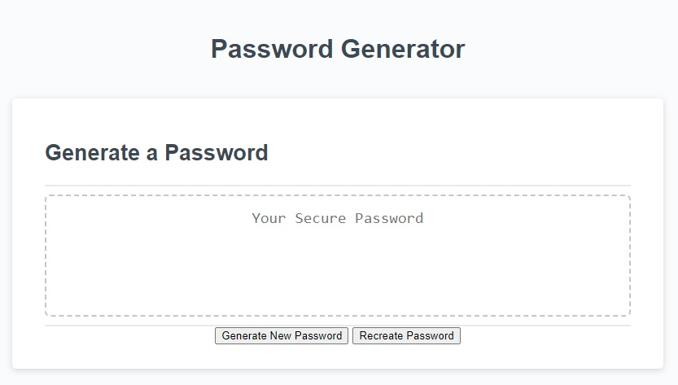

# HOMEWORK 03 JAVASCRIPT RANDOM PASSWORD GENERATOR

## DESCRIPTION

This project was designed to randomly generate a password with specificed criteria. It allows for a length of 8 to 128 characters, including both lower and uppercase letters, numbers and special characters. The generator was made in JavaScript and in creating it I have increased my familiarity with functions within JavaScript. It was made under the instructions provided at [INSTRUCTIONS](./assets/INSTRUCTIONS.md)

## USAGE

To use the generator click the "Generate Password" button to begin. It will prompt you to enter the length of the password. (Note: the prompt will repeat if the length is not between 8 and 128, or if the input is otherwise invalid) Next you will be prompted to add ALL Alphanumeric characters to the available character set; if no is selected, then individual prompts for lowercase, uppercase, and numeric will be shown.  Next it will ask for special characters to added.  After that it should display a randomly generated password based on the answers to the prompts. If you would like to quickly reroll the password with the same length and character set click the "Recreate Password" button. To change the criteria simply click "Generate Password" again.

## FEATURES

-Password Length bettwen 8-128 characters.
-Supports Lowercase, Uppercase, Numeric, and Special character.
-Includes quickprompt to add all alphanumeric characters to available character set at once.
-Shuffles the password after generation to prevent the first four character types from being predictable.
-Recreate Password button to quickly randomize a new password without redoing the prompts.

## SCREENSHOT

## LICENSE

MIT License

Copyright (c) 2023 Yajiit

Permission is hereby granted, free of charge, to any person obtaining a copy
of this software and associated documentation files (the "Software"), to deal
in the Software without restriction, including without limitation the rights
to use, copy, modify, merge, publish, distribute, sublicense, and/or sell
copies of the Software, and to permit persons to whom the Software is
furnished to do so, subject to the following conditions:

The above copyright notice and this permission notice shall be included in all
copies or substantial portions of the Software.

THE SOFTWARE IS PROVIDED "AS IS", WITHOUT WARRANTY OF ANY KIND, EXPRESS OR
IMPLIED, INCLUDING BUT NOT LIMITED TO THE WARRANTIES OF MERCHANTABILITY,
FITNESS FOR A PARTICULAR PURPOSE AND NONINFRINGEMENT. IN NO EVENT SHALL THE
AUTHORS OR COPYRIGHT HOLDERS BE LIABLE FOR ANY CLAIM, DAMAGES OR OTHER
LIABILITY, WHETHER IN AN ACTION OF CONTRACT, TORT OR OTHERWISE, ARISING FROM,
OUT OF OR IN CONNECTION WITH THE SOFTWARE OR THE USE OR OTHER DEALINGS IN THE
SOFTWARE.

